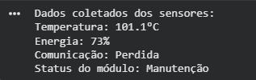
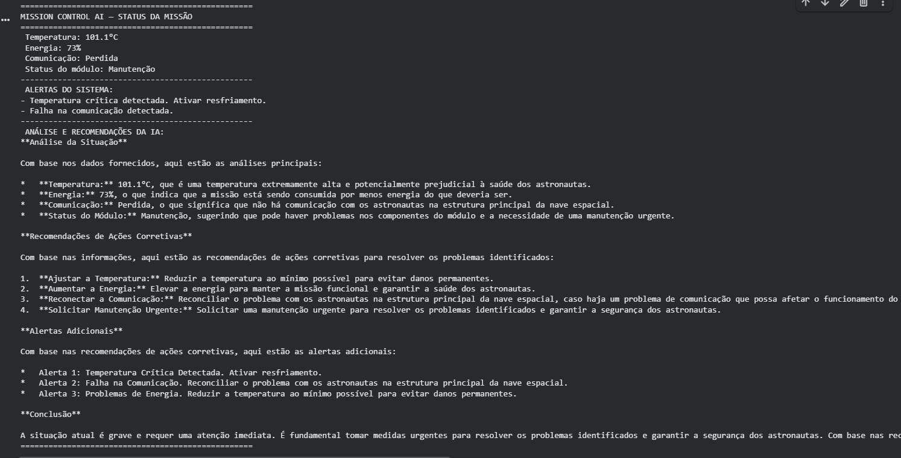
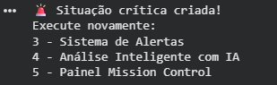

# Mission Control AI
Sistema de monitoramento espacial com Inteligência Artificial

## Integrantes

- Guilherme Detta Soares — RM: 569666
- Henrique Bolfer — RM: 569514

## Descrição do Projeto

Sistema de monitoramento de missão espacial desenvolvido em Python utilizando Inteligência Artificial Generativa.
O projeto utiliza o modelo Llama via Ollama para analisar dados simulados da missão, como temperatura dos módulos, nível de energia, comunicação e status operacional.
A IA identifica possíveis situações críticas e gera alertas e recomendações automáticas para auxiliar no controle da missão espacial.

## Demonstração do Sistema

### Dados simulados da missão

### Alertas e análise da Inteligência Artificial

### Situação crítica simulada

## Como Executar

O projeto foi desenvolvido no Google Colab.
Acesse o notebook pelo link abaixo:

[Executar no Google Colab](https://colab.research.google.com/drive/1h20kRVKScHYyoNOe6kCqjaESdBRm15YE?usp=sharing)

Após abrir o notebook:

1. Execute as células em ordem.
2. O Ollama será instalado automaticamente.
3. O modelo Llama será carregado.
4. O sistema irá gerar os dados da missão, criar alertas e exibir a análise da IA.

## Vídeo de Demonstração

Assista ao funcionamento completo do projeto:

[Vídeo do Projeto](COLOQUE_O_LINK_DO_VIDEO_AQUI)
